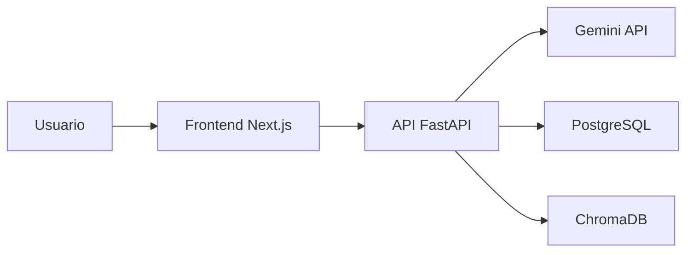

# Arquitectura tecnica

## Vista general



## Estructura principal

```text
soc-copilot/
  apps/
    api/        Backend FastAPI
    web/        Frontend Next.js
  infra/
    docker-compose.yml
    caddy/
    postgres/
  docs/
```

## Backend

Ruta: `apps/api`.

Tecnologias:

- Python 3.12.
- FastAPI.
- Pydantic.
- SQLAlchemy.
- PostgreSQL mediante `psycopg`.
- Gemini mediante `google-genai`.
- ChromaDB preparado para RAG.

Componentes relevantes:

- `app/main.py`: crea la app FastAPI, registra routers y ejecuta `init_db()` en el arranque.
- `app/config.py`: carga variables de entorno.
- `app/db.py`: motor SQLAlchemy, sesiones y creacion de tablas.
- `app/models.py`: modelos `Alert` y `Recommendation`.
- `app/services/llm.py`: adaptador de LLM.
- `app/services/explainer.py`: log a explicacion.
- `app/services/recommender.py`: alerta a acciones recomendadas.
- `app/routers/*.py`: endpoints HTTP.

## Frontend

Ruta: `apps/web`.

Tecnologias:

- Next.js 15.
- React 19.
- TypeScript.
- Tailwind CSS.

Pantallas actuales:

- `/`: estado basico de la API y enlaces.
- `/alerts`: formulario de analisis de logs.
- `/respond?alert_id=N`: recomendaciones para una alerta.
- `/history`: historico de alertas persistidas.

Cliente API:

- `src/lib/api.ts` centraliza las llamadas HTTP a FastAPI.
- `NEXT_PUBLIC_API_URL` define la URL publica usada desde navegador.

## Infraestructura local

Ruta: `infra/docker-compose.yml`.

Servicios:

- `postgres`: base de datos PostgreSQL 16.
- `chroma`: vector store ChromaDB.
- `api`: backend FastAPI en puerto 8080.
- `web`: frontend Next.js en puerto 13000.

Volumenes:

- `postgres-data`: datos persistentes de PostgreSQL.
- `chroma-data`: datos persistentes de ChromaDB.

## Persistencia

Tabla `alerts`:

- Log original.
- Fuente.
- Resumen.
- Nivel de riesgo.
- Tecnicas MITRE.
- Razonamiento.
- Fecha de creacion.

Tabla `recommendations`:

- Relacion con alerta.
- Acciones recomendadas en JSONB.
- Prioridad.
- Notas de aprendizaje.
- Fecha de creacion.

## Integracion LLM

El codigo intenta mantener las llamadas al proveedor aisladas en `LLMAdapter`. Actualmente la implementacion real es `GeminiAdapter`.

Variables relevantes:

```env
GEMINI_API_KEY=
GEMINI_CHAT_MODEL=gemini-2.5-flash
GEMINI_EMBED_MODEL=gemini-embedding-001
```

## Despliegue futuro

El proyecto apunta a desplegarse en un VPS de Hetzner con Caddy como reverse proxy y HTTPS automatico. Esa parte esta planificada para la fase 5.

